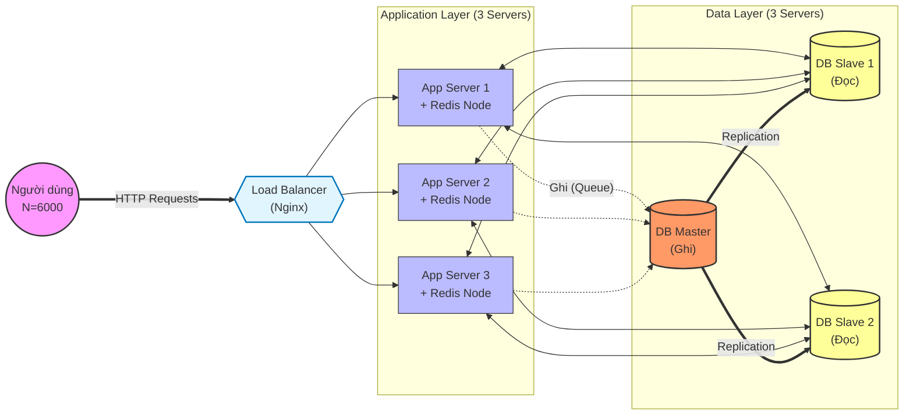
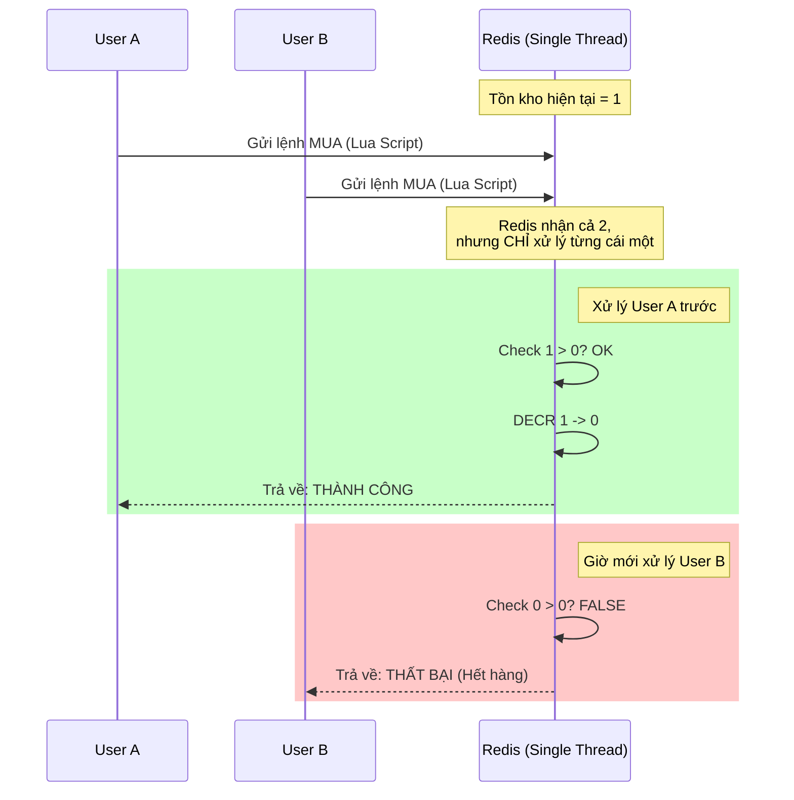
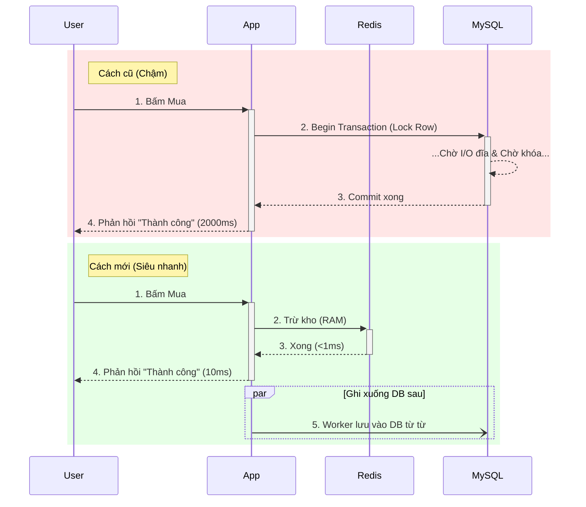

## 1. High-Level Architecture

Hệ thống tuân theo kiến trúc 3 tầng (**3-tier architecture**) được tối ưu hóa cho khả năng xử lý đồng thời cao bằng chiến lược **Ưu tiên In-Memory (In-Memory First)** để giảm tải cho database.

### Chiến lược phân bổ server (S = 6 Servers):
* **3 Servers (Application Layer):** Chạy Web Server (API), Load Balancer và Redis (cấu hình Sentinel, chuyển sang cluster trong tương lai khi số lượng sản phẩm tăng lên hàng triệu và ram của 1 server không chứa nổi nữa).
* **3 Servers (Data Layer):** Chạy Database quan hệ (1 Master, 2 Slaves).


---

## 2. Công nghệ sử dụng

* **Load Balancer:** **Nginx**. Nhẹ, hiệu năng cao, có thể xử lý hàng nghìn kết nối đồng thời.
* **Backend API:** **Java (Spring Boot)** xử lý concurrency tốt. Java có hệ sinh thái mạnh mẽ cho các hệ thống doanh nghiệp.
* **In-Memory Cache & Locking:** **Redis**.
* *Mục đích:* Cache thông tin sản phẩm và quan trọng nhất là bộ đếm tồn kho (Stock counter).
* *Tính năng:* Sử dụng **Redis Lua Scripts** để thực thi nguyên tử (atomic), đảm bảo trừ tồn kho chính xác tuyệt đối mà không cần khóa DB.


* **Database:** **MySQL** hoặc **PostgreSQL**.
* *Mô hình:* Master-Slave replication.


* **Message Queue (Nội bộ):** **Redis Streams** (hoặc blocking queue nội bộ). Do giới hạn , ta không thể dành riêng server cho Kafka/RabbitMQ. Ta tận dụng Redis có sẵn để làm hàng đợi, lưu các đơn hàng thành công để ghi xuống DB sau (asynchronous persistence).

---

## 3. Chi tiết hoạt động & Phân tích yêu cầu

### A. Giải quyết nút thắt cổ chai

* **Vấn đề:** 6000 người cùng truy cập nhưng chỉ có 3 DB server với giới hạn 300 kết nối mỗi server (Tổng 900 kết nối). Nếu truy cập trực tiếp vào DB, hệ thống sẽ sập ngay lập tức.
* **Giải pháp:** **Mô hình lá chắn lưu lượng (Traffic Shield Pattern).** Tuyệt đối không để luồng traffic mua hàng chạm trực tiếp vào DB ngay lập tức.
1. **Xem sản phẩm (Reads):**
* App server kiểm tra **Redis Cache** trước.
* Nếu có (Cache Hit)  trả về ngay (Độ trễ < 5ms).
* Nếu không (Cache Miss)  đọc từ **DB Slaves**, lưu vào Redis rồi trả về.
* *Phân tích:* Với tỷ lệ cache hit 90-95%, chỉ còn khoảng 300-600 request xuống DB slaves, nằm trong khả năng chịu tải của 2 Slaves ( kết nối).


2. **Mua hàng (Writes):**
* Số lượng tồn kho được nạp sẵn vào Redis.
* Việc trừ tồn kho diễn ra hoàn toàn trên RAM của Redis.
* Database chỉ đóng vai trò lưu trữ bền vững (persistence) sau đó.


### B. Đảm bảo tính nhất quán (Không bán quá số lượng - Overselling)

Đây là yêu cầu quan trọng nhất. Chúng ta sử dụng **Redis Atomic Operations (Lua Script)**.

**Quy trình:**

1. Người dùng bấm "Mua".
2. Request đến App Server.
3. App Server chạy một Lua script trên Redis:

```lua
local stock = redis.call('get', KEYS[1])
if tonumber(stock) > 0 then
    redis.call('decr', KEYS[1])
    return 1 -- Thành công
else
    return 0 -- Thất bại (Hết hàng)
end

```

* **Tại sao cách này hiệu quả:** Redis xử lý lệnh theo cơ chế đơn luồng (single-threaded). Nếu 2 người cùng mua món hàng cuối cùng tại cùng một micro-giây, Redis sẽ xếp hàng và xử lý lần lượt. Người đầu tiên trừ kho từ 1 về 0. Người thứ hai thấy 0 và bị từ chối. Không bao giờ xảy ra Race Condition.
* **Lưu trữ:**
* Nếu Redis trả về 1 (Thành công): App server đẩy sự kiện "Đơn hàng tạo thành công" vào **Redis Stream** (Queue).
* Một Worker thread (Consumer) sẽ lấy sự kiện từ Queue và ghi xuống **MySQL Master** với tốc độ ổn định, tuân thủ giới hạn .

**Diagram mô tả luồng xử lý**



### C. Phản hồi thời gian thực & Độ trễ thấp

* Vì việc kiểm tra và trừ kho diễn ra trên RAM (Redis), thao tác chỉ tốn vài micro-giây.
* Người dùng nhận được thông báo "Mua thành công" ngay sau khi Redis xử lý xong, trước khi dữ liệu được ghi xuống MySQL. Điều này đảm bảo trải nghiệm nhanh nhất có thể.

**Diagram minh họa, so sánh giữa cách xử lý truyền thống (App -> MySQL) và cách xử lý mới (App -> Redis)**

---

## 4. Phân tích dựa trên N, C, S

* **N = 6000 Concurrent Requests:**
* Chúng ta có 3 Application Servers. Mỗi server chịu tải  request đồng thời. Các Web Server hiện đại (Nginx/Tomcat) dễ dàng xử lý con số này.


* **S = 6 Servers:**
* Sử dụng 3 cho App/Redis + 3 cho DB. Đã tuân thủ ràng buộc.


* **C = 300 DB Connections:**
* **Luồng Ghi (Write):** Các Worker bất đồng bộ trên 3 App server sẽ tiêu thụ hàng đợi đơn hàng. Ta cấu hình Connection Pool size = 50 trên mỗi App server cho việc ghi. Tổng  kết nối tới Master DB (An toàn, ).
* **Luồng Đọc (Read):** Ta có 2 DB Slaves (Tổng dung lượng  kết nối). Nhờ cơ chế Cache, lượng request thực tế xuống DB sẽ thấp hơn con số 600 này.


---

## 5. Đáp ứng yêu cầu bổ sung (Bonus)

* **Tính sẵn sàng cao (High Availability):**
* **App Layer:** 3 server nằm sau Load Balancer. Nếu 1 server chết, LB điều hướng sang 2 server còn lại.
* **DB Layer:** Master-Slave. Nếu Slave chết, Slave kia gánh tải. Nếu Master chết, Slave có thể được thăng cấp lên làm Master.
* **Redis Layer:** Sử dụng **Redis Sentinel** chạy song song trên các App Server để giám sát và tự động failover (chuyển đổi dự phòng) nếu Redis Node chính bị lỗi.


* **Khả năng mở rộng (Scalability):**
* Có thể thêm App Server theo chiều ngang (Scale out) dễ dàng.
* Có thể áp dụng **Database Sharding** (chia nhỏ dữ liệu theo ID sản phẩm) nếu Master DB quá tải trong tương lai.


```

```